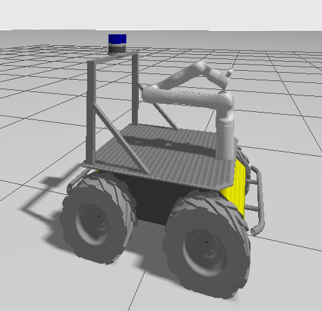

# husky_kinova_sim
Simple simulator for Clearpath Husky A200 that has a Kinova Gen3 arm, Velodyne VLP 16 lidar, and Omni 60 camera. 



Velodyne lidar point cloud topic is published on `/velodyne_points`. Camera image topics are published on `/camera0/image_raw`, `/camera1/image_raw`, etc, for all 5 cameras. 


1. Clone repo 

```bash
mkdir -p ros2_ws/src

cd ~/ros2_ws/src

git clone https://github.com/Moth-Balls/husky_kinova_sim.git
```

2. Install dependecies

This should install all the dependencies but I may have missed one.

```bash
sudo apt-get install ros-jazzy-gz-ros2-control ros-jazzy-ros-gz ros-jazzy-ros-gz-bridge ros-jazzy-moveit
```

Sometimes rosdep works but it may still miss some.


```bash
rosdep update

rosdep install --from-paths src --ignore-src -y
```

3. Building

```bash
cd ~/ros2_ws

colcon build --symlink-install

source install/setup.bash
```

4. Launching 

You can launch an empty world with this command.

```bash
ros2 launch husky_kinova_sim husky_kinova_empty.launch.py
```

Headless world with green objects can be launched as well.

```bash
ros2 launch husky_kinova_sim husky_kinova_headless.launch.py
```
